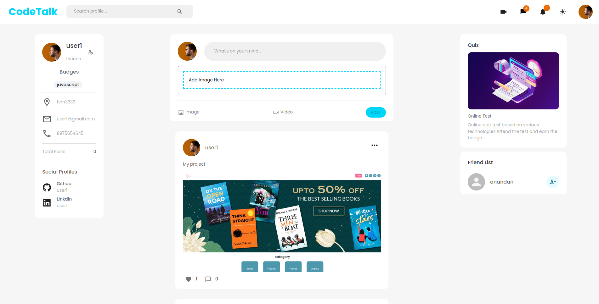

# Code Talk
# Developers Social Network
## Table of contents

- [Introduction](#introduction)
- [Demo](#demo)
- [Run](#run)
- [Technology](#technology)
- [Features](#features)
- [License](#license)

## Introduction

A  Social media  website using React js, Redux, Node js, Express js, and MongoDb.

NOTE: Please read the RUN section before opening an issue.

> **Warning: Code Talk is still in development**, constantly being optimized and isn't still stable enough to be used in production environments

## Demo

CodeTalk is a social network for developers to showcase their projects or products with other developers across the globe. Just like any other social network out there, you can like posts, save them privately, leave a comment and follow your favorite developers to build your feed. Also, have features for real-time messages and video chat

In order to access the admin panel on "/admin" you need to provide the admin email and password.

## Technology

The application is built with:

- React.js
- Redux
- Node.js 
- MongoDB
- Express 
- Tailwind
- Material UI 
- Socket.IO
- Nodemailer
- Google-Auth

## Features

- SignUp, and log in With the JWT token, OTP
  verification
- Admin Page, Block User
- Follow/UnfollowUser
- Create, Edit, Delete Post
- Users can attend quiz tests created by the admin
  to get badges
- Live Chat, Integrated with Socket I/O
- Notification feature
- Live Video Call, with WebRTC
- Login with Google

## Run Backend

To run this application, you have to set your own environmental variables. For security reasons, some variables have been hidden from view and used as environmental variables with the help of dotenv package. Below are the variables that you need to set in order to run the application:

- MONGO_URI :   This is the MongoDB Connection Url (string).

- JWT_SECRET :  This is the JWT SECRET ID (string).

- BASE_URL:     This is the Base URL of Website (string).

- HOST:         This is the HOST OF Email Service  eg:"smtp.gmail.com" (string).

- SERVICE:      This is the SERVICE For Email sending eg:"gmail" (string).
  
- USER:         This is the USER Email For Sending Email eg:"example.gmail.com" (string).

- PASS:         This is the App password of email accound (string).

- PORT:         Specify the port Number

Also you need to insert admin username and password in database eg:{username:"admin",password:"12345"} 

After you've set these environmental variables in the .env file at the root of the project, and intsall node modules using  `npm install`

Now you can run `npm start` in the terminal and the application should work.

## Run Client Side

intsall node modules using  `npm install`

Now you can run `npm run dev` in the terminal and the Client Side should start working.

## License

- MIT License
- Copyright 2022 © [VISHNUTVM](https://github.com/vishnutvm)
